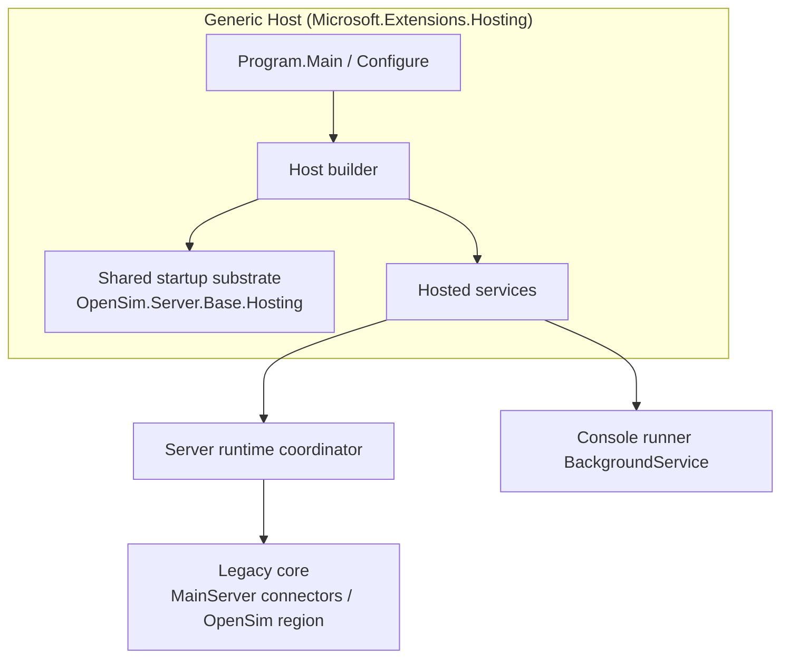

# Hosted Service Architecture

> **Status:** As-built reference for the completed hosted-service migration
> (branch `feature/hosted-services`). This document describes the final architecture of
> the three migrated server executables — **MoneyServer**, **GridServer**, and
> **RegionServer** — running on the .NET generic host.
>
> Companion documents:
> - Lifecycle & ordering: [HostedServiceStartupShutdownSequence.md](HostedServiceStartupShutdownSequence.md)
> - Process-exit dispositions: [HostedServiceEnvironmentExitAudit.md](HostedServiceEnvironmentExitAudit.md)
> - Validation/integration checklist: [HostedServiceMigrationRegressionChecklist.md](HostedServiceMigrationRegressionChecklist.md)
> - Original intent: [HostedServiceMigrationPlan.md](HostedServiceMigrationPlan.md), [HostedServiceImplementationBacklog.md](HostedServiceImplementationBacklog.md)

## 1. Goals realized

The migration moved all three executables off their legacy entry points
(`Application.Main()` / `ServicesServerBase.Run()` blocking loops) onto
`Microsoft.Extensions.Hosting`. The end state delivers:

- The generic **host owns application lifetime** — startup and shutdown flow through
  `IHostedService.StartAsync` / `StopAsync` and `IHostApplicationLifetime`.
- **Side-effect-free constructors**; boot work happens in a runtime coordinator invoked
  from `StartAsync`.
- **Console loops are cancellable hosted background services**, not main-thread `while`
  loops.
- **No `Environment.Exit` on the happy path** (see the [exit audit](HostedServiceEnvironmentExitAudit.md)).
- A **shared startup substrate** (`OpenSim.Server.Base.Hosting`) reused by all three servers.

## 2. Two host flavors

The servers converge on the same conceptual shape but use two concrete host
configurations reflecting how far each subsystem could be modernized:

| Aspect | MoneyServer / GridServer | RegionServer |
| --- | --- | --- |
| Option parsing | `System.CommandLine` (`RootCommand`/`Option<T>`) | Raw `args` + Nini `ArgvConfigSource` probe |
| Configuration | `IConfiguration` via `ConfigureAppConfiguration` (ini providers) | Legacy Nini `IConfigSource` built in the runtime |
| DI container | **Autofac** (`AutofacServiceProviderFactory`) + connector scanning | Default `Microsoft.Extensions.DependencyInjection` |
| Web stack | **ASP.NET Core** (`ConfigureWebHostDefaults`, MVC controllers) | Legacy `BaseHttpServer` created inside the region runtime |
| Process setup / PID | Dedicated hosted services (`ProcessSetupHostedService`, `PidFileHostedService`) | Folded into `RegionRuntime` |
| Legacy core | Service connectors loaded into `MainServer` | Full `OpenSim` inheritance chain (`OpenSim : OpenSimBase : RegionApplicationBase : BaseOpenSimServer : ServerBase`) |

> **Why the difference?** Money and Grid are service hosts whose endpoints map cleanly to
> ASP.NET controllers and DI-resolved connectors. RegionServer wraps the large, still
> inheritance-driven `OpenSim` region runtime; it was adopted under the host via an adapter
> (`RegionRuntime`) and then **composed** (Sprints 7–8) rather than rewritten.



## 3. Shared startup substrate (`OpenSim.Server.Base.Hosting`)

The reusable building blocks live in
[Source/OpenSim.Server.Base/Hosting](Source/OpenSim.Server.Base/Hosting). Each is an
interface + default implementation so servers depend on abstractions and tests can
substitute fakes.

| Component | Interface / Type | Responsibility |
| --- | --- | --- |
| Log bootstrap | `ILog4NetBootstrapper` / `Log4NetBootstrapper` | Configure log4net before the host is built; resolve the effective config file. |
| Process setup | `IProcessSetupService` / `ProcessSetupService` (+ `ProcessSetupHostedService`, `ProcessSetupOptions`) | Apply culture, `ServicePointManager`, thread-pool, DNS, HTTP-client defaults. |
| PID file | `IPidFileManager` / `PidFileManager` (+ `PidFileHostedService`) | Create the PID file on start, remove on stop. |
| Main server access | `IMainServerAccessor` / `MainServerAccessor` | Wrap the static `MainServer.Instance` (HTTP server registry / `Stop()`). |
| Runtime monitoring | `IRuntimeMonitoringController` / `RuntimeMonitoringController` | Wrap `Watchdog`, `MemoryWatchdog`, `WorkManager` enable/disable/stop. |
| Startup failure | `IStartupFailureCoordinator` / `StartupFailureCoordinator` | Centralize fatal-startup handling so failures surface as exceptions through `StartAsync`. |
| Console context | `IConsoleContext` / `ConsoleContext`, `IConsoleFactory` / `ConsoleFactory` | Create an `ICommandConsole` (`basic`/`local`/`rest`/`mock`) and publish it to the static `MainConsole.Instance`. |
| Legacy config bridge | `ILegacyConfigSourceAccessor` / `LegacyIniConfigSourceAccessor` | Expose a Nini `IConfigSource` for components not yet on `IConfiguration`. |
| Startup options | `ServerStartupOptions` | Typed `logconfig` / `inifile` / `inimaster` / `inidirectory` / `console`. |
| Ini configuration | `IniConfigurationExtensions` (`AddOpenSimIniFiles`) | Add OpenSim ini precedence (master → files → directory) to `IConfiguration`. |

Connector discovery for the service hosts is handled by
[RegisterServices](Source/OpenSim.Server.Base/RegisterServices.cs), which scans
`OpenSim.*.dll` and `addon-modules/` into the Autofac registry.

## 4. Per-server architecture

### 4.1 MoneyServer

Entry: [Source/OpenSim.Server.MoneyServer/Program.cs](Source/OpenSim.Server.MoneyServer/Program.cs).
The most fully modernized server: `System.CommandLine` options, `IConfiguration`, Autofac,
and ASP.NET Core MVC controllers.

DI singletons: `IProcessSetupService`, `IPidFileManager`, `IMainServerAccessor`,
`IRuntimeMonitoringController`, `MoneySessionStore`, `IStartupFailureCoordinator`,
`IMoneyServerRuntime` / `MoneyServerRuntime`, plus `IConsoleContext`,
`ILegacyConfigSourceAccessor`, `IServerBase`, and `IMoneyDBService` registered into Autofac.

Hosted services (registration → start order):

1. `ProcessSetupHostedService`
2. `PidFileHostedService`
3. `MoneyService` ([MoneyService.cs](Source/OpenSim.Server.MoneyServer/MoneyService.cs)) — `StartAsync` → `_runtime.Initialize()` + `Startup()`; `StopAsync` → `_runtime.Stop()`.
4. `MoneyConsoleRunnerService` — interactive prompt loop.

ASP.NET Core: controllers (`AddControllers().AddControllersAsServices()`,
`MapControllers`) hosted via `ConfigureWebHostDefaults`; URLs from
`MoneyServer:AspNetUrls` / `MoneyServer:AspNetPort`.

### 4.2 GridServer

Entry: [Source/OpenSim.Server.GridServer/Program.cs](Source/OpenSim.Server.GridServer/Program.cs).
Same shape as MoneyServer, with a grid-specific connector loader.

DI singletons: `IProcessSetupService`, `IPidFileManager`, `IMainServerAccessor`,
`IRuntimeMonitoringController`, `IStartupFailureCoordinator`,
`IServiceConnectorLoader` / `GridServiceConnectorLoader`,
`IGridServerRuntime` / `GridServerRuntime`, plus the Autofac-registered `IServerBase`.

Hosted services (registration → start order):

1. `ProcessSetupHostedService`
2. `PidFileHostedService`
3. `GridService` ([GridService.cs](Source/OpenSim.Server.GridServer/GridService.cs)) — `StartAsync` → `_runtime.Initialize()` + `Startup()` (registers common commands/components); `StopAsync` → `_runtime.Stop()`.
4. `GridConsoleRunnerService`

`GridServerRuntime` ([GridServerRuntime.cs](Source/OpenSim.Server.GridServer/GridServerRuntime.cs))
publishes the console to `MainConsole.Instance`, constructs the legacy
`HttpServerBase` under host control (config load + HTTP listeners), and loads service
connectors via `IServiceConnectorLoader`. Shutdown disables the watchdog, stops
`MainServer`, stops the work manager, and calls `serverBase.Shutdown()`.

### 4.3 RegionServer

Entry: [Source/OpenSim.Server.RegionServer/Program.cs](Source/OpenSim.Server.RegionServer/Program.cs).
Uses the default DI container (no Autofac/ASP.NET); wraps the legacy `OpenSim` region
runtime via an adapter and composes the startup concerns into service seams.

DI singletons: `RegionHostOptions`, `IProcessSetupService`, `IStartupFailureCoordinator`,
`IRuntimeMonitoringController`, `IRegionDiagnosticsService`,
`IRegionRuntime` / `RegionRuntime`.

Hosted services (registration → start order):

1. `RegionService` ([RegionService.cs](Source/OpenSim.Server.RegionServer/RegionService.cs)) — `StartAsync` → `_runtime.Initialize()`; `StopAsync` → `_runtime.Stop()`.
2. `RegionConsoleRunnerService` — **registered only in foreground (interactive) mode**; omitted when `--background` is set (`IsBackground(args)`).

`RegionRuntime` ([RegionRuntime.cs](Source/OpenSim.Server.RegionServer/RegionRuntime.cs))
applies process setup, builds the Nini `IConfigSource`, constructs `new OpenSim(config)`,
calls the non-blocking `Startup()`, and starts diagnostics. `Stop()` stops diagnostics,
disables the watchdog, sets `SuppressExit = true`, calls `Shutdown()`, then stops the work
manager. Process setup and PID handling are folded into the runtime rather than separate
hosted services.

## 5. RegionServer composition seams (Sprints 7–8)

Because the RegionServer inheritance chain (`OpenSim` → `OpenSimBase` →
`RegionApplicationBase` → `BaseOpenSimServer` → `ServerBase`) is **`new`-constructed, not
DI-resolved**, its extracted collaborators are exposed as `protected` properties with
default implementations (log4net-based, self-instantiable). Only the DI-constructed
`RegionRuntime` receives constructor-injected `ILogger` services.

| Seam | Interface / Type | Extracted concern | Host property |
| --- | --- | --- | --- |
| Diagnostics | `IRegionDiagnosticsService` / `RegionDiagnosticsService` | Periodic stats/uptime/threads timer | injected into `RegionRuntime` |
| HTTP factory | `IRegionHttpServerFactory` / `RegionHttpServerFactory` | Create & start the main `BaseHttpServer` | `RegionApplicationBase.HttpServerFactory` |
| Status handlers | `IRegionStatusHandlerRegistrar` / `RegionStatusHandlerRegistrar` | Register sim status / robots / managed-stats handlers | `OpenSim.StatusHandlerRegistrar` |
| Plugins | `IRegionPluginService` / `RegionPluginService` | Application-plugin load / post-init / dispose | `OpenSimBase.PluginService` |
| Startup scripts | `IRegionStartupScriptService` / `RegionStartupScriptService` | Startup/shutdown/timed console scripts | `OpenSim.StartupScriptService` |
| Certificates | `IRegionCertificateProvisioner` / `RegionCertificateProvisioner` | TLS cert create/convert before listeners | `OpenSimBase.CertificateProvisioner` |
| Ready watchdog | `IRegionReadyStatusMonitor` / `RegionReadyStatusMonitor` | Gate watchdogs on all-regions-ready | `OpenSimBase.ReadyStatusMonitor` |

These files live in [Source/OpenSim.Server.RegionServer](Source/OpenSim.Server.RegionServer).

## 6. Console runners

Each server isolates its interactive prompt loop into a cancellable
`BackgroundService`, registered last so it begins only after every other service has
started:

- [RegionConsoleRunnerService.cs](Source/OpenSim.Server.RegionServer/RegionConsoleRunnerService.cs)
- [GridConsoleRunnerService.cs](Source/OpenSim.Server.GridServer/GridConsoleRunnerService.cs)
- [MoneyConsoleRunnerService.cs](Source/OpenSim.Server.MoneyServer/MoneyConsoleRunnerService.cs)

Common contract: wait for `IHostApplicationLifetime.ApplicationStarted`, then run the
blocking `Prompt()` on a thread-pool thread, exiting cleanly when the `stoppingToken` is
cancelled. RegionServer reads the process-wide `MainConsole.Instance`; Grid/Money read the
DI-provided `IServerBase.Console`.

## 7. Compatibility shims (and retirement guidance)

These intentional bridges let the host model drive code that still assumes the legacy
static/inheritance world. They are documented so they can be removed as the underlying code
is decomposed further.

| Shim | Where | Retire when… |
| --- | --- | --- |
| `MainConsole.Instance = …` (static console publish) | `ConsoleContext`, `GridServerRuntime.Initialize` | legacy code reads console via DI instead of the static. |
| Console prompt loop as `BackgroundService` | `*ConsoleRunnerService` | console I/O is abstracted behind a hosted input source. |
| `SuppressExit = true` before `Shutdown()` | `RegionRuntime.Stop` | `BaseOpenSimServer.ShutdownSpecific` no longer calls `Environment.Exit`. |
| `new HttpServerBase(...)` inside the runtime | `GridServerRuntime.Initialize` | HTTP listener creation is fully extracted to a DI service (cf. RegionServer's `IRegionHttpServerFactory`). |
| `protected` property-injected service seams | RegionServer `OpenSim*` classes | the inheritance chain is replaced by DI-constructed components. |
| `ILegacyConfigSourceAccessor` (Nini bridge) | Money/Grid | all consumers read typed `IConfiguration`/options. |
| `IStartupFailureCoordinator.ThrowFatal(...)` | all runtimes | the flagged in-lifecycle `Environment.Exit` calls are converted to exceptions (see audit). |

## 8. Lifecycle summary

Hosted services start in registration order and stop in reverse. The detailed start/stop
sequences (with mermaid diagrams) are in
[HostedServiceStartupShutdownSequence.md](HostedServiceStartupShutdownSequence.md). Key
guarantees, validated by tests:

- Runtime `Initialize()`/`Stop()` are idempotent (double-checked lock).
- `host.StartAsync()` propagates runtime init failures instead of exiting.
- Interactive and background modes both start/stop deterministically through host APIs.
- Console runners never read input before `ApplicationStarted` and exit cleanly on cancel.

## 9. Testing

Automated coverage lives in
[Tests/OpenSim.Server.Base.Tests/Hosting](Tests/OpenSim.Server.Base.Tests/Hosting) and
includes substrate tests (process setup, PID, console runners), per-server host-lifecycle
tests, and the RegionServer seam unit tests. Run:

```bash
dotnet build Tranquillity.sln --configuration Debug
dotnet test Tests/OpenSim.Server.Base.Tests/OpenSim.Server.Base.Tests.csproj --configuration Debug
```

For end-to-end / integration validation before project closure, work through
[HostedServiceMigrationRegressionChecklist.md](HostedServiceMigrationRegressionChecklist.md),
which marks each check as automated `[A]` or manual smoke `[M]`.

## 10. Known residuals

The migration is functionally complete. Remaining items are recommendations, not blocking
work, tracked in the [Environment.Exit audit](HostedServiceEnvironmentExitAudit.md):

1. Convert the flagged in-lifecycle `Environment.Exit` calls
   (`BaseOpenSimServer.Startup`, `OpenSimBase.CreateRegion`) into exceptions surfaced
   through the host.
2. Apply a `SuppressExit`-style guard to `ServicesServerBase.ShutdownSpecific` so the
   shared Grid/Money base returns control to the host on shutdown.
3. Progressively retire the compatibility shims in section 7 as the legacy core is
   decomposed.
