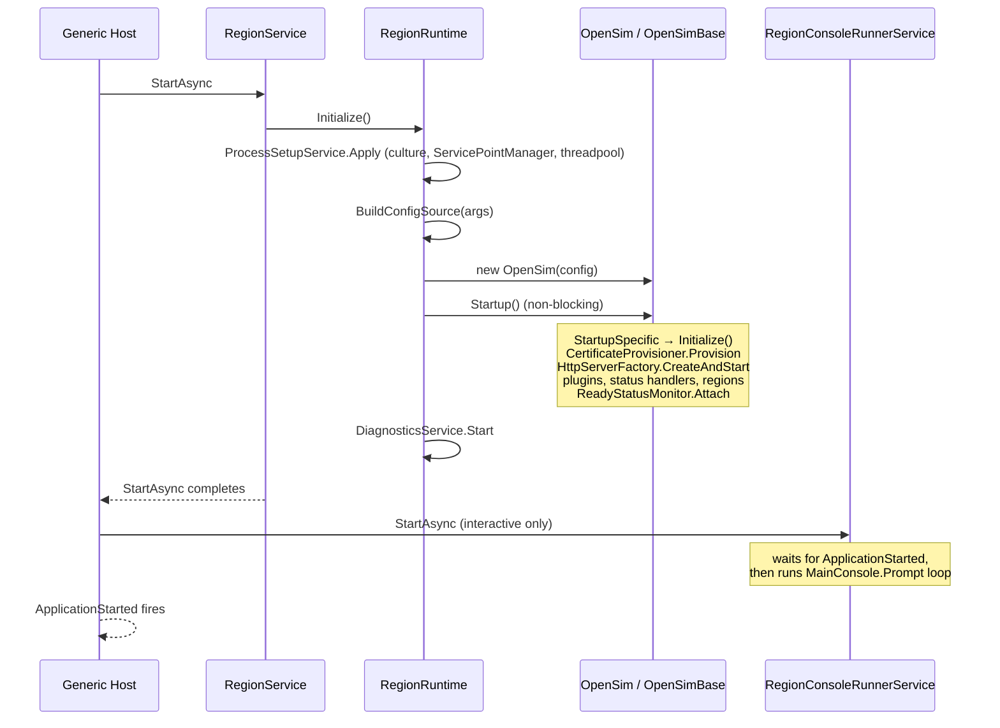
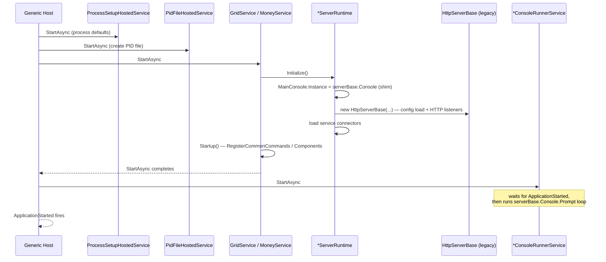

# Hosted Service Startup / Shutdown Sequence (X2)

This document describes the deterministic startup and shutdown order for the three
migrated servers — **RegionServer**, **GridServer**, **MoneyServer** — now that each runs
on the .NET generic host (`Microsoft.Extensions.Hosting`). It also records the compatibility
shims that bridge the new host model to the legacy inheritance-chain code that has not yet
been fully decomposed.

## Generic-host model in one paragraph

Each executable's `Program.Main` builds an `IHost`, registers a small set of singletons and
**hosted services** (`IHostedService` / `BackgroundService`), then calls `host.RunAsync()`.
The host starts hosted services **in registration order** and stops them in **reverse
registration order**. Process lifetime is owned by the host: there is no `while (true)`
prompt loop and no `Environment.Exit` on the hosted happy path (see the
[Environment.Exit audit](HostedServiceEnvironmentExitAudit.md)). The interactive console
prompt loop is itself a hosted `BackgroundService`, registered last so it only begins
reading input after every other service has started.

## RegionServer

Entry point: [Source/OpenSim.Server.RegionServer/Program.cs](Source/OpenSim.Server.RegionServer/Program.cs).
RegionServer folds process setup and PID-file handling into `RegionRuntime` rather than
into separate hosted services.

Hosted services (registration order):

1. `RegionService` ([Source/OpenSim.Server.RegionServer/RegionService.cs](Source/OpenSim.Server.RegionServer/RegionService.cs)) — orchestrates the region runtime.
2. `RegionConsoleRunnerService` ([Source/OpenSim.Server.RegionServer/RegionConsoleRunnerService.cs](Source/OpenSim.Server.RegionServer/RegionConsoleRunnerService.cs)) — **only registered in foreground (interactive) mode**; omitted when `--background` is set.

### Startup order



### Shutdown order (reverse of startup)

```mermaid
sequenceDiagram
    participant Host as Generic Host
    participant CR as RegionConsoleRunnerService
    participant RS as RegionService
    participant RT as RegionRuntime
    participant Sim as OpenSim / OpenSimBase

    Host->>CR: StopAsync (interactive only)
    Note over CR: stoppingToken cancels prompt loop
    Host->>RS: StopAsync
    RS->>RT: Stop()
    RT->>RT: DiagnosticsService.Stop()
    RT->>RT: MonitoringController.DisableWatchdog()
    RT->>Sim: SuppressExit = true; Shutdown()
    Note over Sim: ShutdownSpecific → SceneManager.Close,<br/>PluginService.Dispose, MainServer.Stop,<br/>RemovePIDFile (no Environment.Exit: SuppressExit)
    RT->>RT: MonitoringController.StopWorkManager()
    RS-->>Host: StopAsync completes
```

## GridServer and MoneyServer

Entry points:
[Source/OpenSim.Server.GridServer/Program.cs](Source/OpenSim.Server.GridServer/Program.cs),
[Source/OpenSim.Server.MoneyServer/Program.cs](Source/OpenSim.Server.MoneyServer/Program.cs).
Both follow the same shape and, unlike RegionServer, register process setup and PID-file
handling as **dedicated hosted services** so those concerns participate explicitly in the
host start/stop ordering.

Hosted services (registration order):

1. `ProcessSetupHostedService` — applies process-level defaults.
2. `PidFileHostedService` — creates the PID file on start, removes it on stop.
3. `GridService` / `MoneyService` — orchestrates the service runtime (`*ServerRuntime`).
4. `GridConsoleRunnerService` / `MoneyConsoleRunnerService` — interactive console prompt loop.

### Startup order



### Shutdown order (reverse of startup)

```mermaid
sequenceDiagram
    participant Host as Generic Host
    participant CR as *ConsoleRunnerService
    participant GS as GridService / MoneyService
    participant RT as *ServerRuntime
    participant PID as PidFileHostedService
    participant PS as ProcessSetupHostedService

    Host->>CR: StopAsync (cancel prompt loop)
    Host->>GS: StopAsync
    GS->>RT: Stop()
    RT->>RT: MonitoringController.DisableWatchdog()
    RT->>RT: MainServer.Stop(); Sleep(500); StopWorkManager()
    RT->>RT: serverBase.Shutdown()
    Host->>PID: StopAsync (remove PID file)
    Host->>PS: StopAsync
```

> Cross-cutting residual: on the hosted Grid/Money path `serverBase.Shutdown()` can still
> reach `ServicesServerBase.ShutdownSpecific`, which calls `Environment.Exit(0)`. This is
> tracked in the [Environment.Exit audit](HostedServiceEnvironmentExitAudit.md) with a
> recommended `SuppressExit`-style guard.

## Compatibility shims (bridging new host ↔ legacy code)

These shims exist so the host model can drive code that still assumes the old static /
inheritance-chain world. They are intentional and documented so they can be removed as the
underlying code is decomposed further.

| Shim | Where | Why it exists |
| --- | --- | --- |
| `MainConsole.Instance = serverBase.Console` | `GridServerRuntime.Initialize` / Money equivalent | Legacy code reads the process-wide static `MainConsole.Instance`; the runtime publishes the host-created console into it. |
| Console prompt loop as `BackgroundService` | `*ConsoleRunnerService` | Replaces the legacy blocking `while (true) MainConsole.Prompt()` / `ServicesServerBase.Run()` loop without owning process lifetime. |
| `SuppressExit = true` before `Shutdown()` | `RegionRuntime.Stop` | Neutralises the legacy `Environment.Exit(0)` in `BaseOpenSimServer.ShutdownSpecific` so the host owns process exit. |
| `new HttpServerBase(...)` inside the runtime | `GridServerRuntime.Initialize` | The legacy base still owns config loading and HTTP listener creation; it is now constructed under host control instead of in the hosted-service constructor. |
| Composed `protected` service properties (e.g. `CertificateProvisioner`, `ReadyStatusMonitor`, `HttpServerFactory`, `PluginService`, `StatusHandlerRegistrar`, `StartupScriptService`) | RegionServer `OpenSim*`/`RegionApplicationBase` | The inheritance-chain classes are `new`-constructed (not DI-resolved), so extracted collaborators are exposed as property-injected services with default implementations. |
| `IStartupFailureCoordinator.ThrowFatal(...)` | all three runtimes | Centralises fatal-startup handling so failures surface as exceptions through `host.StartAsync()` rather than ad-hoc `Environment.Exit`. |

## Determinism guarantees (validated by tests)

- The runtime `Initialize()` / `Stop()` are idempotent and guarded by a double-checked lock,
  so repeated host start/stop is safe.
- `host.StartAsync()` propagates a runtime initialization failure instead of exiting
  (`RegionServiceHostLifecycleTests.Host_StartAsync_Throws_WhenRuntimeInitializeFails`).
- Interactive and background modes both start and stop deterministically through the host
  lifetime APIs (`RegionServiceHostLifecycleTests.Host_Interactive_*` /
  `Host_Background_*`).
- The console runner does not read input before `ApplicationStarted` and exits cleanly on
  cancellation (`RegionConsoleRunnerServiceTests`, and the Grid/Money equivalents).
